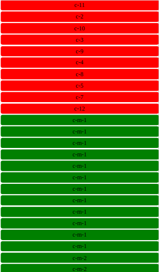
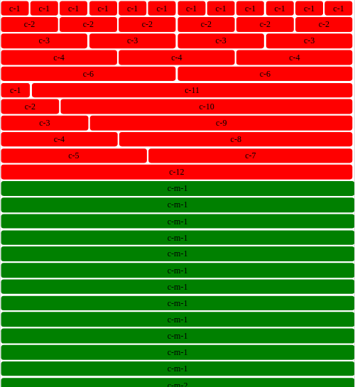
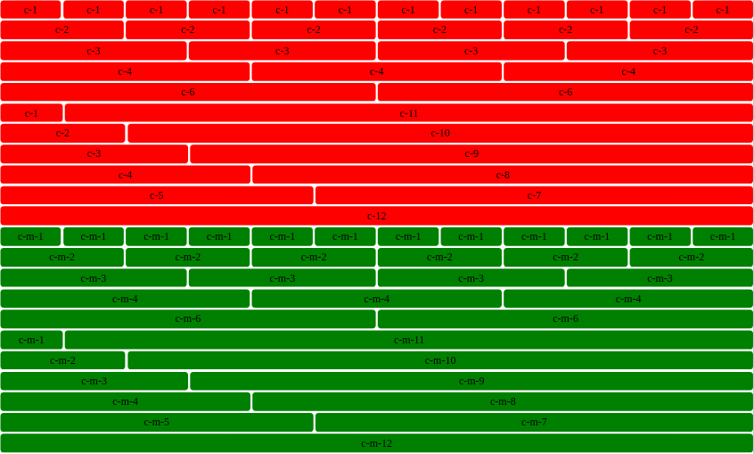

## Status

Completed

## About

A responsive 12-column grid system using Flexbox. The system comes in 2 tiers:

 1. small (.c-*)
 2. medium (.c-m-*)

Examples:

 - c-3 is 3 of 12 columns wide (25%) for device widths greater than 575px.
 - c-m-3 is 3 of 12 columns wide (25%) for device widths greater than 767px.

The page lives here: https://pictureelement.github.io/flexbox-grid/

## Page Samples

**_viewport width_ < 576px**

**575px < _viewport width_ < 768px**

**_viewport width_ > 767px**

## Copyright

&copy; 2017 Marios Sofokleous

Feel free to inspect the code structure, and reuse anything for your own needs.